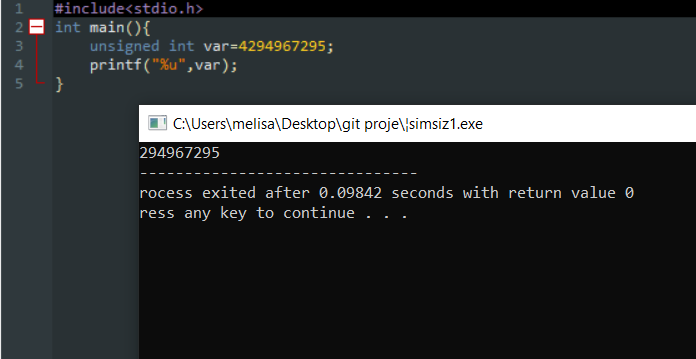
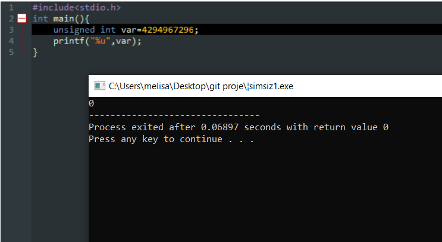
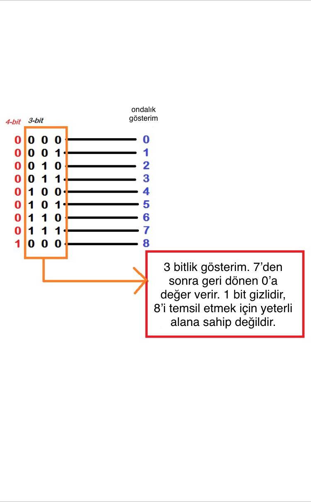

# GEÇERLİ VERİ TÜRLERİNİN AŞILMASI
## C PROGRAMLAMA DİLİNDE GEÇERLİ YERLEŞİK VERİYİ AŞARSAK NE OLUR?
Küçük bir örnek ile başlayalım.(unsigned int) İşaretsiz bir tam sayının 4294967295 olduğunu biliyoruz.

Bir değişken alıp ona işaretsiz bir tam sayının değerini atayalım ve sonucu görelim..

   

Sonuç beklediğimiz gibi geldi öyle değil mi?Peki biz bu değeri bir arttırırsak ve 4294967296 olarak girersek ne olur?
   

Girdi olarak değeri 4294967296 girdiğimizde derleyicinin döndüreceği değer 0 oldu.

Peki bunun neden olduğuna bakalım hemen..

Açıklamak için daha basit bir değer alıyorum. 3 bitlik bir gösterimi alalım. 3 bitlik bir sistemde minimum değer=0 , maximum değer=7'dir. Peki biz 3 bitlik bir sistemde 8 değerini elde etmeye çalışsak ne olur?

 

Görüldüğü gibi 8 ondalık sayısını temsil etmek için 4 bite ihtiyacımız var. 8 değerini 3 bit ile göstermeye zorladığımızda işaretli gösterimi elde ederiz. Yani sadece 4.biti, 3 bitlik bir gösterime alamıyorum çünkü sınır aşmış oluyor.
 
 3 bitlik bir gösterimde 4.bit, varsa diğer üst bitler gizlidir. Ve burada da 8 değerinin 3 bitlik gösterimde 0 olduğunu görmüş olduk.

 9 olarak girdi vermek istersek; 9 değerinin normal şartlarda 4 bit yer aldığını ve ikilik gösteriminin 1001 olduğunu biliyoruz. Ve 3 bitlik bir sistem için sınırı aşmış oluyoruz. _Biz bir değeri aşsak da elimizde var olan yere göre değerlendiriyoruz._ Yani 9 değeri için 4 bitlik bir alana ihtiyacımız olsa da ve elimizde 3 bitlik bir yer varsa, 4. bite yer vermeden sistemimiz ilk 3 biti kullanıyor ve 9 değeri için derleyici 1 döndürüyor.

 Bu süreci bir saat olarak hayal edin..
 Saat, ibresini 12'den sonra tekrar 1'e hareket ettirir.Benzer şekilde derleyici maksimum değere ulaştıktan sonra minimum değerini döndürür.

 Umarım maksimum değeri aştığımızda ne olacağına dair net bir fikriniz oluşmuştur.

  _iyi öğrenmeler :)_

